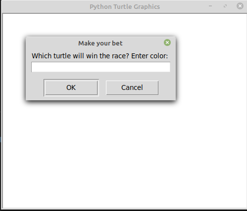
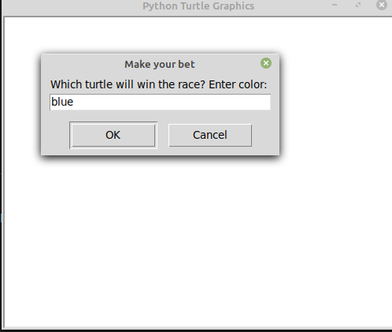
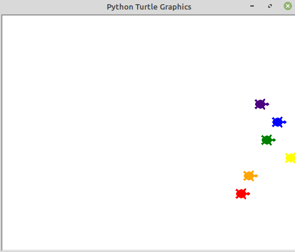

# Day19
A quiz game built with OOP where the user gets to answer true or false to some qustions

## Lessons learned today

- Event listeners

- state 

- multiple instances

- high_order functions 

## Project to solidify material learned 

### Turtle_Race:
> Application of Higher order functions and  state are used to create a turtle racing game, where the user is represented with a screen and asked to guess which turtle will win the race.


#### Preview:






## How to run this on your device

- Clone this repository
```
git clone https://github.com/kingdreamerr/Day19_Turtle_Race.git
```
- cd into the repo
```
cd Day19_Turtle_Race
```

- Paste the following in the terminal 
```
python3 main.py
```
